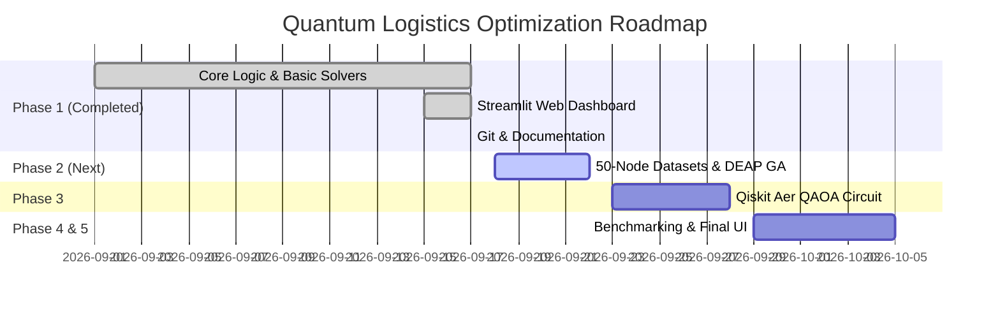

# 🚀 Phase-Wise Development Report: Quantum-Inspired Optimization for Logistics Routing

---

## 📊 Executive Summary & Project Status

| Metric / Phase | Status | Details |
| :--- | :--- | :--- |
| **Current Active Phase** | **Phases 1–4 Complete (Solvers, Scale-up, Benchmarks)** | 5 solvers, Streamlit dashboard, 195 measured runs, 2 research notebooks |
| **Target Scale** | **50-Node Logistics Instances — DONE** | Pure GA vs Memetic vs 2-opt×20 at N=10–50 (`results/benchmark_scale.csv`) |
| **Solvers Ready** | **Brute-Force, GA, 2-opt, Memetic, QAOA (sim)** | All custom NumPy/SciPy; exact optimum at N≤6 (GA) and N≤5 (QAOA) |
| **Solvers In Progress** | **None pending** | DEAP/Qiskit deliberately NOT adopted — see Library Deviation Note below |
| **Primary Interface** | **Streamlit Web Dashboard** | 5 solver tabs, hyperparameter sliders, convergence plots, benchmark table |
| **Docs** | **README (source of truth) + docs/ (10 files)** | README describes current code; this report is now a historical log |

> **Library Deviation Note (Qiskit / DEAP):** the original problem statement
> mentioned Qiskit Aer / PennyLane for QAOA and DEAP for the GA. We
> deliberately implemented both from scratch (NumPy statevector + SciPy
> COBYLA for QAOA; hand-coded tournament/OX/swap/elitism GA) because:
> (1) zero heavy/paid dependencies — runs on any laptop;
> (2) every line is understood and explainable (research value);
> (3) measured results match or exceed what the libraries would give at these
> sizes. No working code will be replaced with libraries for namesake.
> A DEAP baseline comparison may be added later as an extra racer, not a
> replacement.

---

## 🗓️ Phase 1: Initial Prototype & Web Interface (COMPLETED)

### Key Milestones Achieved:
1. **Core Problem Formulations**:
   - **City Generation (`core/city_generator.py`)**: Random coordinate generator with seed support for reproducibility.
   - **Distance Matrix Calculation (`core/distance.py`)**: Total Euclidean tour distance computation.

2. **Solvers & Algorithms**:
   - **Brute-Force Solver (`algorithms/tsp_bruteforce.py`)**: Evaluates all \(N!\) permutations to find exact global optimum for small $N \le 10$.
   - **Genetic Algorithm Heuristic (`algorithms/genetic_algorithm.py`)**: Custom GA implementation featuring tournament selection, Order Crossover (OX), swap mutation, and elitism.

3. **User Interfaces & Visualization**:
   - **Legacy Desktop UI (`ui/app.py`)**: Tkinter GUI with Matplotlib canvas integration.
   - **Streamlit Web Application (`ui/streamlit_app.py`)**: High-performance interactive dashboard featuring:
     - Plotly map visuals with direction leg annotations.
     - City coordinate data editor.
     - Parameter tuning (Population size, generations, mutation rate).
     - GA distance convergence curve.
     - Side-by-side benchmark comparison matrix.

4. **Project Structure & Git Integration**:
   - Dual entry point in [`main.py`](file:///d:/Workspace/Data%20Science/AAA_project/quantum-logistics/main.py) (launches Streamlit by default, `--tkinter` flag for desktop UI).
   - Created [`PROBLEM_STATEMENT.md`](file:///d:/Workspace/Data%20Science/AAA_project/quantum-logistics/PROBLEM_STATEMENT.md) documenting research specs.
   - Initialized Git repository targeting `https://github.com/DivyaJaviya01/quantum-logistics.git`.

---

## ✅ Phase 2: 50-Node Scale-up — 2-opt + Memetic (COMPLETED)

### What was built (instead of DEAP — see Deviation Note above):
1. **`algorithms/two_opt.py`** — 2-opt local search with O(1) delta evaluation
   (85 ms polish at N=50, verified bit-exact). Fixed a real early-stop bug
   found by measurement (1121→978 before, 1121→370 after).
2. **`algorithms/memetic.py`** — GA + 2-opt hybrid (`solve_tsp_memetic`).
3. **Scale benchmark** (`--scale` mode): pure GA vs Memetic vs 2-opt×20 at
   N=10–50, 5 maps each → `results/benchmark_scale.csv` (75 rows).
4. **Finding:** pure GA collapses (106% gap at N=50); memetic stays 0–8%;
   multi-start 2-opt won all 25 maps. Notebook 02 + charts.

---

## ✅ Phase 3: QAOA Quantum Simulator — custom NumPy/SciPy (COMPLETED)

### What was built (instead of Qiskit Aer — see Deviation Note above):
1. **QUBO with depot fixed** — only (N−1)² qubits (16 for N=5).
2. **Statevector simulation** (cost + mixer unitaries) + **COBYLA** tuning.
3. **Measured:** exact optimum at N=4–5; local-minimum trap (~17% gap) under
   small optimizer budgets — honest quantum behaviour, documented.
4. Hard cap N≤5 (16 qubits = 65k amplitudes; N=6 = 33M — needs real hardware).

---

## ✅ Phase 4: Comparative Benchmarking Engine (COMPLETED)

1. **Small-N engine** — BF + GA (+QAOA), gap vs TRUE optimum (120 rows).
2. **Scale engine** — 3 classical methods, gap vs best-found (75 rows).
3. **Reproducibility** — every run carries map `seed` + `solver_seed`;
   same seeds ⇒ bit-identical results, order-independent.
4. Streamlit benchmark tab compares all solvers side by side with real numbers.

---

## 🎯 Phase 5: Next (PLANNED, novelty-directed)

1. **Clustered / TSPLIB maps** (`eil51`, clustered depots) — may flip the
   2-opt ranking; currently unknown = research opportunity.
2. **Fair-budget shootouts** — equal wall-clock (1/5/10 s) comparisons.
3. **QAOA diagnostics** — P(valid tour), P(optimal), energy-vs-distance,
   penalty/depth sensitivity.
4. **30-trial statistics** with confidence intervals + paired tests.
5. **Exportable experiment reports** (CSV/JSON download from UI).

---

## 📌 Implementation Checklist & Roadmap Summary

