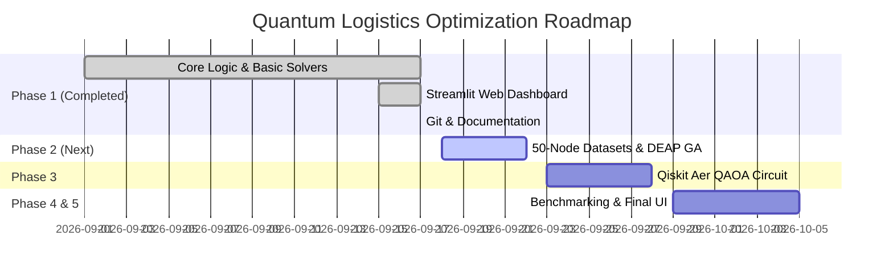

# 🚀 Phase-Wise Development Report: Quantum-Inspired Optimization for Logistics Routing

---

## 📊 Executive Summary & Project Status

| Metric / Phase | Status | Details |
| :--- | :--- | :--- |
| **Current Active Phase** | **Phase 1 Complete (Foundations & UI)** | Initial prototype, core logic, Streamlit web app, Git repository initialized |
| **Target Scale** | **50-Node Logistics Instances** | Scaling up from initial 5-8 node prototype to 50 nodes |
| **Solvers Ready** | **Brute-Force & Classical GA (Basic)** | Exact brute-force search & custom GA implementation |
| **Solvers In Progress** | **DEAP GA & Qiskit Aer QAOA** | Phase 2 & 3 targets |
| **Primary Interface** | **Streamlit Web Dashboard** | Interactive Plotly maps, hyperparameter sliders, benchmark table |

---

## 🗓️ Phase 1: Initial Prototype & Web Interface (COMPLETED)

### Key Milestones Achieved:
1. **Core Problem Formulations**:
   - **City Generation (`core/city_generator.py`)**: Random coordinate generator with seed support for reproducibility.
   - **Distance Matrix Calculation (`core/distance.py`)**: Total Euclidean tour distance computation.

2. **Solvers & Algorithms**:
   - **Brute-Force Solver (`algorithms/tsp_bruteforce.py`)**: Evaluates all \(N!\) permutations to find exact global optimum for small $N \le 10$.
   - **Genetic Algorithm Heuristic (`algorithms/genetic_algorithm.py`)**: Custom GA implementation featuring tournament selection, Order Crossover (OX), swap mutation, and elitism.

3. **User Interfaces & Visualization**:
   - **Legacy Desktop UI (`ui/app.py`)**: Tkinter GUI with Matplotlib canvas integration.
   - **Streamlit Web Application (`ui/streamlit_app.py`)**: High-performance interactive dashboard featuring:
     - Plotly map visuals with direction leg annotations.
     - City coordinate data editor.
     - Parameter tuning (Population size, generations, mutation rate).
     - GA distance convergence curve.
     - Side-by-side benchmark comparison matrix.

4. **Project Structure & Git Integration**:
   - Dual entry point in [`main.py`](file:///d:/Workspace/Data%20Science/AAA_project/quantum-logistics/main.py) (launches Streamlit by default, `--tkinter` flag for desktop UI).
   - Created [`PROBLEM_STATEMENT.md`](file:///d:/Workspace/Data%20Science/AAA_project/quantum-logistics/PROBLEM_STATEMENT.md) documenting research specs.
   - Initialized Git repository targeting `https://github.com/DivyaJaviya01/quantum-logistics.git`.

---

## 🎯 Phase 2: DEAP Framework & 50-Node TSPLIB Integration (NEXT IMPLEMENTATION)

### Objectives:
1. **Scale Problem Generator to 50 Nodes**:
   - Add TSPLIB parser (`core/dataset_loader.py`) to load standard 50-node benchmark datasets (e.g., `eil51`, `berlin52`).
   - Implement scalable 50-node random cluster generator with customizable depot coordinates.

2. **DEAP Evolutionary Algorithm Engine**:
   - Integrate `deap` (Distributed Evolutionary Algorithms in Python) framework (`algorithms/ga_deap.py`).
   - Standardize operators: `cxOrdered` (OX), `mutShuffleIndexes`, `selTournament`.
   - Implement multi-run statistics collector (mean, std dev, min distance history over 100+ generations).

---

## ⚛️ Phase 3: Qiskit Aer QAOA Quantum Simulator (UPCOMING)

### Objectives:
1. **QUBO / Cost Hamiltonian Formulation**:
   - Map 50-node TSP / VRP constraints to Quadratic Unconstrained Binary Optimization (QUBO) format.
   - Formulate Cost Hamiltonian ($H_C$) and Mixer Hamiltonian ($H_M$).

2. **Qiskit Aer Execution (`algorithms/qaoa.py`)**:
   - Implement QAOA parameterized quantum circuits ($p$-layers) using `qiskit-optimization` and `qiskit-aer` simulators.
   - Include Quantum-Inspired Heuristic / Simulated Annealing fallback for heavy 50-node statevector execution.

---

## 📈 Phase 4: Comparative Benchmarking Engine (UPCOMING)

### Objectives:
1. **Side-by-Side Performance Analytics**:
   - Benchmark **Tour Length** (Solution quality / accuracy).
   - Benchmark **Compute Runtime** (Execution time in seconds).
   - Compare **Convergence Rates** (Cost decrease over iterations/generations).

2. **Google OR-Tools Baseline Integration**:
   - Add Google `ortools` routing solver as a classical gold standard baseline.

---

## 🎨 Phase 5: Streamlit Production Dashboard & Report Export (UPCOMING)

### Objectives:
1. **50-Node Interactive Visualization**:
   - Upgrade Streamlit UI with 50-node zoomable vector maps.
   - Add convergence plot overlay comparing GA vs. QAOA vs. OR-Tools on the same chart.

2. **Automated Export & Summary**:
   - Download CSV / JSON benchmark reports.
   - Generate summary PDF / Markdown research summary directly from the web app.

---

## 📌 Implementation Checklist & Roadmap Summary

