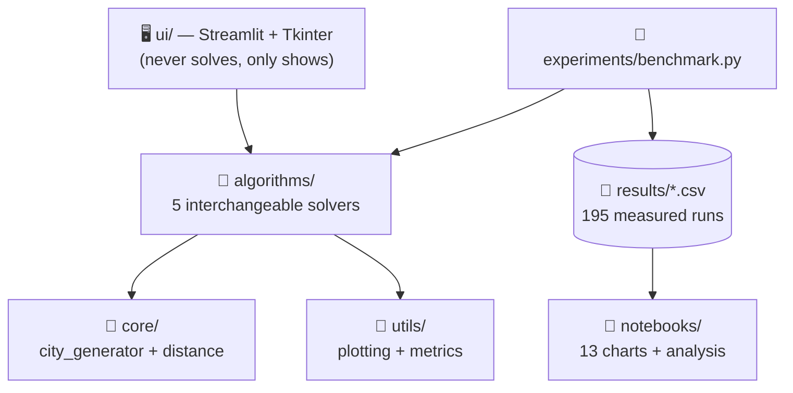

<div align="center">

# ⚛️ Quantum Logistics

### Quantum-Inspired Optimization for Logistics Routing

*From brute-force to evolution to quantum dreaming — one lab that races them all.*

[](https://www.python.org/)
[](https://streamlit.io/)
[](https://numpy.org/)
[](https://scipy.org/)
[](./notebooks/)
[](https://github.com/DivyaJaviya01/quantum-logistics/pulls)

[🚀 Quickstart](#-quickstart) •
[📊 Results](#-headline-results) •
[📓 Notebooks](#-research-notebooks) •
[📚 Full Docs](./docs/00_START_HERE.md) •
[🧪 Benchmarks](#-benchmarks)

---

### `5` solvers · `195` measured maps · `13` charts · `0` quantum computers needed

</div>

---

<div align="center">

## 🎯 What is this?

</div>

A delivery shop must visit every house once and return — the **Travelling
Salesman Problem (TSP)**. Checking every route works for 5 houses (24 routes)
but is impossible for 50 (a **62-digit** number of routes).

This project builds **5 solvers**, races them fairly on **195 test maps**,
and plots everything — then tells you honestly what won, what collapsed,
and what is still unknown.

> 👶 **New here?** Start with [`docs/00_START_HERE.md`](./docs/00_START_HERE.md) —
> the whole project explained in simple words, assuming zero background.
>
> 📚 Prefer the guided tour? [`docs/`](./docs/00_START_HERE.md) holds **10 files**:
> TSP from zero → every solver → every chart explained → every number traced.

<div align="center">

## ✨ Why this project stands out

</div>

| 🧪 | 🔬 | 📖 |
|---|---|---|
| **A real lab, not a demo**<br/>Benchmark runner, 195 CSV rows,<br/>reproducible seeds throughout | **Bugs caught by data**<br/>2-opt early-stop found via<br/>measurement, fixed, re-proven | **Honest science**<br/>Negative results published:<br/>GA collapses, QAOA gets trapped |

<div align="center">

## 🏎️ Meet the racers

</div>

| | Solver | Idea in one line | 🏆 Best moment |
|---|---|---|---|
| ⚡ | **Brute-Force** | Checks every route, keeps the shortest | Always perfect (≤ 10 cities) |
| 🧬 | **Genetic Algorithm** | Evolves routes like breeding racehorses | Optimal through 6 cities |
| 🔧 | **2-opt ×20** | Uncrosses roads, restarts 20×, keeps best | **Won all 25 big maps** |
| 🧬➕ | **Memetic (GA + 2-opt)** | Evolves, then polishes the champion | Within 0–8% at every size |
| ⚛️ | **QAOA (simulated)** | Quantum circuit on NumPy + SciPy — no Qiskit, no paid API | Exact optimum at N = 4–5 |

> One contract — `solver(cities) → (route, distance)` — so **solver #6 is one
> file away**. Nothing else changes.

<div align="center">

## 📊 Headline results

</div>

> **Small maps** — gap vs *proven* optimum · **Big maps** — gap vs *best-found*
> (optimum unknowable at N = 50)

| Cities | ⚡ Brute-Force | 🧬 Pure GA | 🧬➕ Memetic | 🔧 2-opt ×20 | ⚛️ QAOA |
|---|---|---|---|---|---|
| 4–6 | 0% | **0%** | — | — | **0%** |
| 7–9 | 0% | 0.2% → 5% | — | — | needs hardware |
| 20 | 💀 impossible | 27% | 2% | **0%** | 💀 impossible |
| 30 | 💀 | 44% | 6% | **0%** | 💀 |
| 40 | 💀 | 74% | 8% | **0%** | 💀 |
| 50 | 💀 | 106% (2× worse!) | 4% | **0%** | 💀 |

📖 Full tables, statistics & per-chart stories →
[`docs/06_results.md`](./docs/06_results.md) ·
[`docs/04_experiment_small_maps.md`](./docs/04_experiment_small_maps.md) ·
[`docs/05_experiment_big_maps.md`](./docs/05_experiment_big_maps.md)

<details>
<summary><b>🖥️ Real terminal output — <code>python test_memetic.py</code></b></summary>

```
   N |    Pure GA |    Memetic |     Gain |  GA time | Mem time
----------------------------------------------------------------
  10 |      339.0 |      337.3 |    0.50% |    4685ms |    4135ms
  30 |      536.3 |      475.2 |   11.40% |    9458ms |    5327ms
  50 |      940.5 |      892.0 |    5.16% |    7853ms |    7858ms
```

</details>

<div align="center">

## 🏗️ Architecture

</div>



<div align="center">

[](https://numpy.org/)
[](https://scipy.org/)
[](https://pandas.pydata.org/)
[](https://matplotlib.org/)
[](https://seaborn.pydata.org/)
[](https://plotly.com/)
[](https://streamlit.io/)
[](https://jupyter.org/)

*100% free & open-source stack. No paid APIs. No Qiskit. No cloud.*

</div>

<div align="center">

## 🚀 Quickstart

</div>

```bash
git clone https://github.com/DivyaJaviya01/quantum-logistics.git
cd quantum-logistics
pip install -r requirements.txt

python main.py              # 🌐 web app → http://localhost:8501
python test_memetic.py      # ✅ GA vs memetic at 10–50 cities
python -m experiments.benchmark --scale --trials 5   # 🔬 full big-map race
```

<details>
<summary><b>📓 Research notebooks</b></summary>

| Notebook | Study |
|---|---|
| `01_tsp_research_analysis` | Small maps: landscape, convergence, tuning, scaling, 30-trial stats, QAOA roadmap |
| `02_scale_up_memetic` | Big maps: GA collapse, before/after polish, win table |

Each ships an `_executed` twin with all charts pre-rendered — just open in VS Code.

</details>

<details>
<summary><b>🧪 Benchmark commands</b></summary>

```bash
# Small-N: brute-force + GA (+ optional QAOA), gap vs TRUE optimum
python -m experiments.benchmark --trials 10 --max-cities 9 --quick

# Big-N: pure GA vs memetic vs 2-opt×20, gap vs best-found
python -m experiments.benchmark --scale --trials 5
```

</details>

<div align="center">

## 📁 Structure

</div>

```
quantum-logistics/
├── algorithms/   ⚡🧬🔧🧬➕⚛️  five solvers, one interface
├── core/         🍳  map maker + measuring tape
├── ui/           🖥️  Streamlit web app + Tkinter desktop
├── utils/        🧰  plotting + metrics
├── experiments/  🔬  benchmark runner
├── notebooks/    📓  analysis with charts (source + executed)
├── results/      🗂️  195 measured runs (CSV)
├── docs/         📚  beginner-to-expert guide (10 files)
└── test_*.py     ✅  health checkups per solver
```

<div align="center">

## 🗺️ Roadmap

</div>

- [x] Brute-force baseline + Streamlit UI
- [x] Genetic Algorithm (OX crossover, elitism)
- [x] Real QAOA simulation (NumPy + SciPy, N ≤ 5)
- [x] 2-opt + memetic hybrid, 50-city scale-up
- [ ] 🧪 Clustered / real-road maps (may flip the ranking — unknown!)
- [ ] ⚖️ Fair QAOA-vs-classical shootout at equal time budgets
- [ ] 🧬 Custom hybrid of our own design

<div align="center">

## 🤝 Contributors

<table align="center">
  <tr>
    <td align="center">
      <a href="https://github.com/DivyaJaviya01">
        <br />
        <b>Divya Javiya</b>
      </a><br />
      <sub>Owner · architecture, solvers, benchmarks</sub>
    </td>
    <td align="center">
      <a href="https://github.com/Rachit-Dudhaiya">
        <br />
        <b>Rachit Dudhaiya</b>
      </a><br />
      <sub>Collaborator · RK University, Rajkot</sub>
    </td>
  </tr>
</table>

---

## ⚠️ Honest note

Nothing here is new to science (2-opt: 1958, memetic: 1989, QAOA: 2014) —
and we say so loudly in [`docs/07_honest_limits.md`](./docs/07_honest_limits.md).
What IS ours: **195 measured runs, bugs caught by data, and a lab where the
next idea takes an afternoon to test.** Replication with teeth. 🔬

---

<i>Built with ⚛️ curiosity · If this helped you, leave a ⭐</i>

</div>
